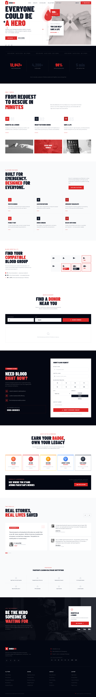
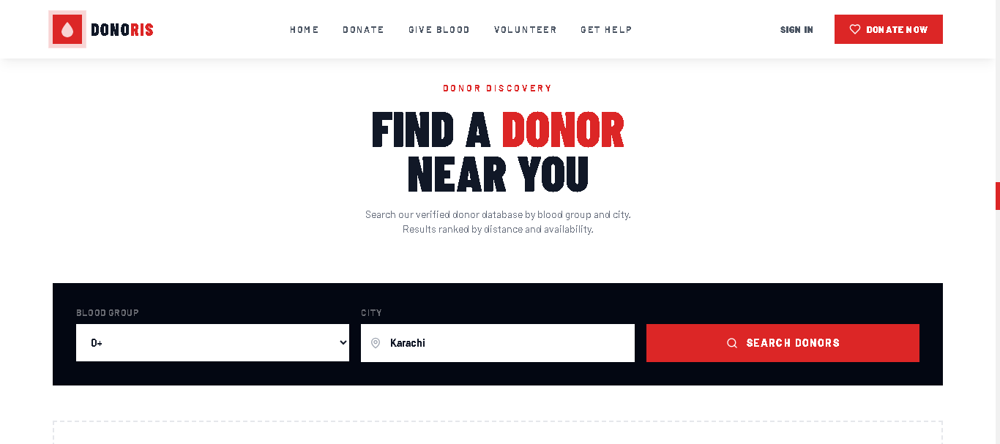

# Donoris



Donoris is a modern blood donor platform built as a responsive web application for Pakistan. It connects blood seekers with verified donors, supports emergency requests, and offers an engaging donor registration experience.

## 🚀 Project Overview

The application is implemented as a Vite + React + TypeScript website.

Key features:
- Responsive landing page with hero section, stats, badges, and testimonials
- Donor discovery search by blood group and city
- Emergency request and donor matching experience
- Donor registration and login flows using local auth simulation
- Blood group compatibility and donor availability guidance
- Animated UI using Framer Motion

## 🧩 Tech Stack

- React
- TypeScript
- Vite
- Tailwind CSS
- Framer Motion
- lucide-react
- ESLint

## 📁 Repository Structure

- `Website/` - core frontend application
  - `src/` - source code
  - `src/components/` - page and UI components
  - `src/context/` - auth and modal state
  - `src/lib/auth.ts` - local auth/profile storage logic
  - `supabase/` - database migration files (project reference)

## ⚙️ Getting Started

From the `Website/` folder:

```bash
cd Website
npm install
npm run dev
```

Open the local Vite URL shown in the terminal.

## 📸 Screenshots



## ✅ Available Scripts

- `npm run dev` - start development server
- `npm run build` - create production build
- `npm run preview` - preview production build locally
- `npm run lint` - run ESLint
- `npm run typecheck` - run TypeScript type check

## 💡 Notes

- Authentication is currently simulated using browser `localStorage`.
- Donor search UI uses mock donor data for demonstration.
- The app is designed as a polished marketing site and proof-of-concept donor ecosystem.

## 📌 How to Contribute

1. Fork the repository
2. Create a feature branch
3. Make changes and test locally
4. Open a pull request with a clear description

## 📞 Contact

For questions or improvements, update the docs and issue tracker in this repository.
